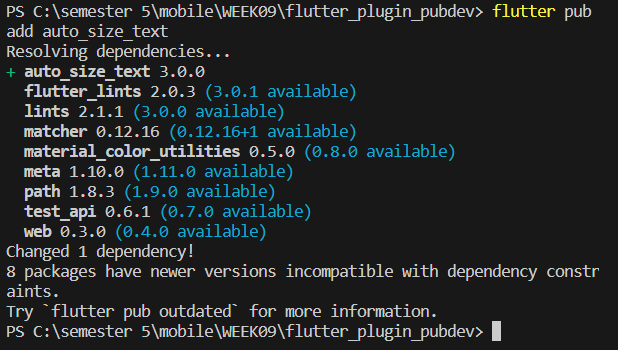
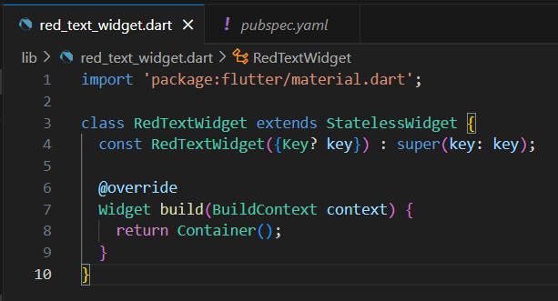
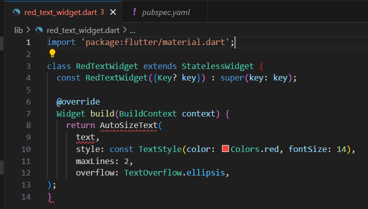
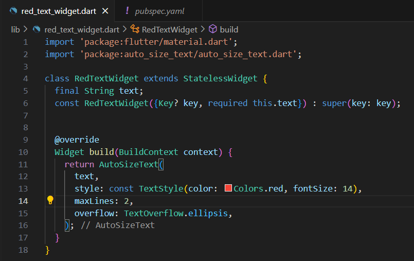
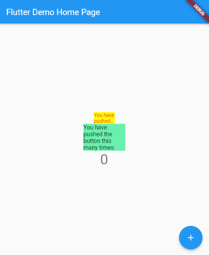
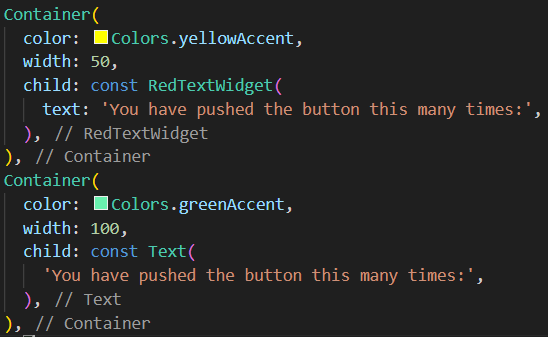
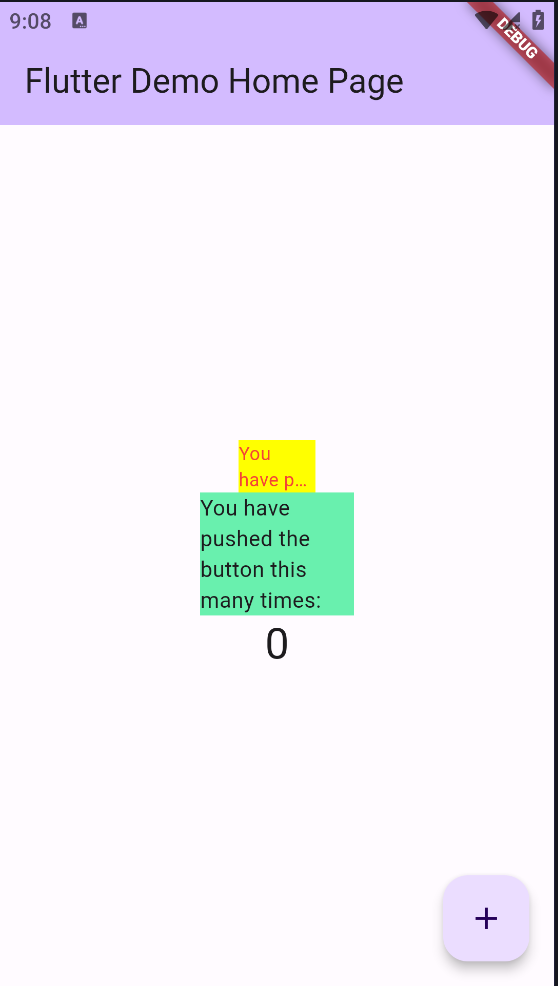

# <b>Laporan Pertemuan 9 - Praktikum Menerapkan Plugin di Project Flutter</b>
<b> Nama: Abdullah Khafabi

Kelas: TI 3A

NIM: 2041720050 </b>

## <b>Praktikum: Menerapkan Plugin di Project Flutter</b>

Selesaikan langkah-langkah praktikum berikut ini menggunakan editor Visual Studio Code (VS Code) atau Android Studio atau code editor lain kesukaan Anda.

### <b>Langkah 1: Buat Project Baru</b>

Buatlah sebuah project flutter baru dengan nama flutter_plugin_pubdev. Lalu jadikan repository di GitHub Anda dengan nama flutter_plugin_pubdev.
1

### <b>Langkah 2: Menambahkan Plugin</b>

Tambahkan plugin auto_size_text menggunakan perintah berikut di terminal

    flutter pub add auto_size_text

<b>Jawab:</b>

### <b>Langkah 3: Buat file red_text_widget.dart</b>

Buat file baru bernama red_text_widget.dart di dalam folder lib lalu isi kode seperti berikut.

import 'package:flutter/material.dart';

    class RedTextWidget extends StatelessWidget {
    const RedTextWidget({Key? key}) : super(key: key);

    @override
    Widget build(BuildContext context) {
        return Container();
    }
    }

<b>Jawab:</b>

### <b>Langkah 4: Tambah Widget AutoSizeText</b>

Masih di file red_text_widget.dart, untuk menggunakan plugin auto_size_text, ubahlah kode return Container() menjadi seperti berikut.

    return AutoSizeText(
        text,
        style: const TextStyle(color: Colors.red, fontSize: 14),
        maxLines: 2,
        overflow: TextOverflow.ellipsis,
    );

Setelah Anda menambahkan kode di atas, Anda akan mendapatkan info error. Mengapa demikian? Jelaskan dalam laporan praktikum Anda!

<b>Jawab:</b>

Pada kode diatas error karena variabel text belum didefinisikan dan belum melakukan import untuk package auto_size_text.

### <b>Langkah 5: Buat Variabel text dan parameter di constructor</b>

Tambahkan variabel text dan parameter di constructor seperti berikut.

    final String text;

    const RedTextWidget({Key? key, required this.text}) : super(key: key);

<b>Jawab:</b>

### <b>Langkah 6: Tambahkan widget di main.dart</b>

Buka file main.dart lalu tambahkan di dalam children: pada class _MyHomePageState

    Container(
    color: Colors.yellowAccent,
    width: 50,
    child: const RedTextWidget(
                text: 'You have pushed the button this many times:',
            ),
    ),
    Container(
        color: Colors.greenAccent,
        width: 100,
        child: const Text(
            'You have pushed the button this many times:',
            ),
    ),

Run aplikasi tersebut dengan tekan F5, maka hasilnya akan seperti berikut.

<b>Jawab:</b>

## <b>Praktikum: Tugas Praktikum</b>

1. Selesaikan Praktikum tersebut, lalu dokumentasikan dan push ke repository Anda berupa screenshot hasil pekerjaan beserta penjelasannya di file README.md!

2. Jelaskan maksud dari langkah 2 pada praktikum tersebut!

<b>Jawab:</b>

Pada langkah 2, potongan kode tersebut digunakan untuk menambahkan paket atau plugin AutoSizeText ke dalam project flutter yang telah dibuat. plugin ini memberikan kemampuan pada teks untuk secara otomatis menyesuaikan ukurannya berdasarkan lebar dan tinggi yang tersedia dalam widget tempat teks tersebut ditampilkan.

3. Jelaskan maksud dari langkah 5 pada praktikum tersebut!

<b>Jawab:</b>

Pada langkah 5, melakukan pendefinisian variabel text dengan tipe String untuk memperbaiki error yang terjadi pada langkah 4. Untuk baris kedua adalah deklarasi widget RedTextWidget. Kode ini digunakan untuk menginisialisasi widget dan menerima parameter yang dibutuhkan,

4. Pada langkah 6 terdapat dua widget yang ditambahkan, jelaskan fungsi dan perbedaannya!

<b>Jawab:</b>

Pada langkah 6 terdapat dua widget yang ditambahkan yaitu `RedTextWidget` yang menggunakan`AutoSizeText` dan `Text`

Kedua `widget` ini digunakan untuk menampilkan teks pada widget

Perbedaannya adalah `RedTextWidget` memungkinkan teks untuk menyesuaikan diri dengan batas yang telah ditetapkan karena menggunakan `AutoSizeText`, sedangkan `Text` tidak mengatur ukuran teks secara otomatis

5. Jelaskan maksud dari tiap parameter yang ada di dalam plugin auto_size_text berdasarkan tautan pada dokumentasi ini !

<b>Jawab:</b>

a. text (String):

Parameter ini adalah teks yang akan ditampilkan oleh widget. Nilai teks ini akan diberikan saat membuat instance dari RedTextWidget.

b. style (TextStyle):

Parameter ini menentukan gaya teks, seperti warna dan ukuran font. Dalam contoh ini, gaya teks diberikan dengan warna merah dan ukuran font 14.

c. maxLines (int):

Parameter ini menentukan jumlah maksimal baris yang dapat ditampilkan oleh widget. Dalam contoh ini, diatur menjadi 2, artinya widget akan menampilkan hingga 2 baris teks sebelum menerapkan TextOverflow.

d. overflow (TextOverflow):

Parameter ini menentukan cara menangani teks jika melebihi jumlah maksimal baris yang ditentukan oleh maxLines. Dalam contoh ini, diatur sebagai TextOverflow.ellipsis, yang berarti teks yang melebihi batas akan ditampilkan sebagai ellipsis (...).

6. Kumpulkan laporan praktikum Anda berupa link repository GitHub ke spreadsheet yang telah disediakan!
